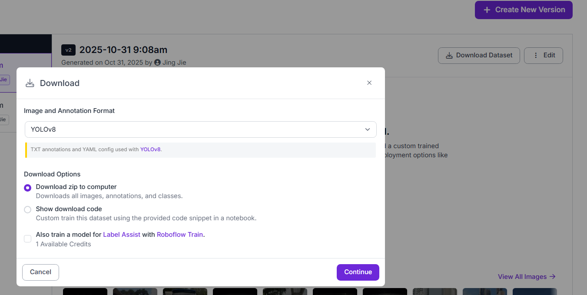

# 🇲🇾 ANPR Malaysia  
*A lightweight and data-driven approach to ANPR (Automatic Number Plate Recognition)*  

---

## ⚙️ Environment Setup  

### 1️⃣ Create and Activate the Conda Environment  

```bash
# Create a new conda environment
conda create -n anpr python=3.9 -y

# Activate the environment
conda activate anpr
```

---

### 2️⃣ Install Dependencies  

#### 🔹 Install PyTorch (CUDA 12.6 compatible)
```bash
pip3 install torch torchvision --index-url https://download.pytorch.org/whl/cu126
```

#### 🔹 Install Other Dependencies
```bash
pip install -r requirements.txt
```

---

## 📦 Dataset Setup  

You can obtain the **training**, **testing**, and **validation** datasets from [Roboflow](https://app.roboflow.com/yolo-zmazg?group=LKaPTDt9jTcODXIwefFB).



1. Go to the link above.  
2. Select the **YOLOv8** format.  
3. Download the dataset code and files.  
4. Extract the **images** and **labels** into your project’s dataset directory.  
5. Place the folder in the structure shown below:  

```
YOLO-ANPR/
│
├── app.py                     # Streamlit application
├── requirements.txt           # Python dependencies
├── README.md                  # Project documentation
│
├── datasets/                  # All datasets stored here
│   ├── V1_data/               # Place your downloaded dataset version folder here
│   │   ├── data.yaml          # YOLO dataset configuration file
│   │   ├── train/             # Training data
│   │   │   ├── images/        # Training images
│   │   │   └── labels/        # Corresponding label files (.txt)
│   │   │
│   │   ├── val/               # Validation data
│   │   │   ├── images/
│   │   │   └── labels/
│   │   │
│   │   └── test/              # Optional test data
│   │       ├── images/
│   │       └── labels/
│
└── runs/                      # (Auto-generated) YOLO training results
```

---

## 🚀 Running the App  

Once your environment and datasets are ready:

```bash
# Navigate to the app directory
cd path/to/app

# Run the Streamlit app
streamlit run app.py
```

The app should launch automatically in your default web browser.

---

## 📁 Project Structure  

```
YOLO-ANPR/
│
├── app/                       # Streamlit application folder
│   ├── app.py                 # Main Streamlit app script
│   ├── components/            # UI components (if applicable)
│   └── utils/                 # Helper functions and scripts
│
├── requirements.txt           # Python dependencies
├── README.md                  # Project documentation
│
├── datasets/                  # All datasets stored here
│   ├── V1_data/               # Primary dataset version
│   └── V2_data/               # Optional alternate dataset version
│
├── OcrModel/                  # OCR model files for plate text recognition
└── plateDETECTOR/             # YOLO-based license plate detection model
```

---

## 💡 Notes  

- Ensure your GPU drivers are up to date for CUDA compatibility.  
- If CUDA is not available, you can install CPU-only PyTorch instead.  
- Recommended Python version: **3.9**  
- Recommended YOLO version: **YOLOv8**  

---

## 🏷️ Credits  

Developed with ❤️ using **YOLOv8**, **Streamlit**, and **PyTorch**.
